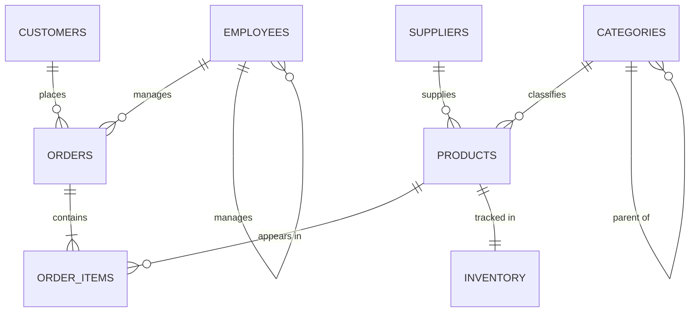
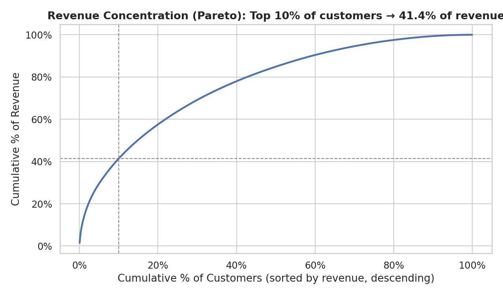
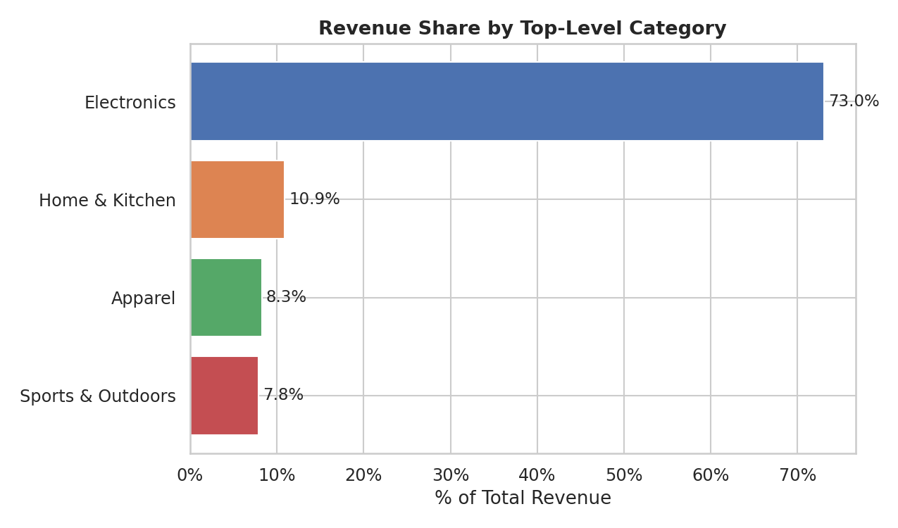
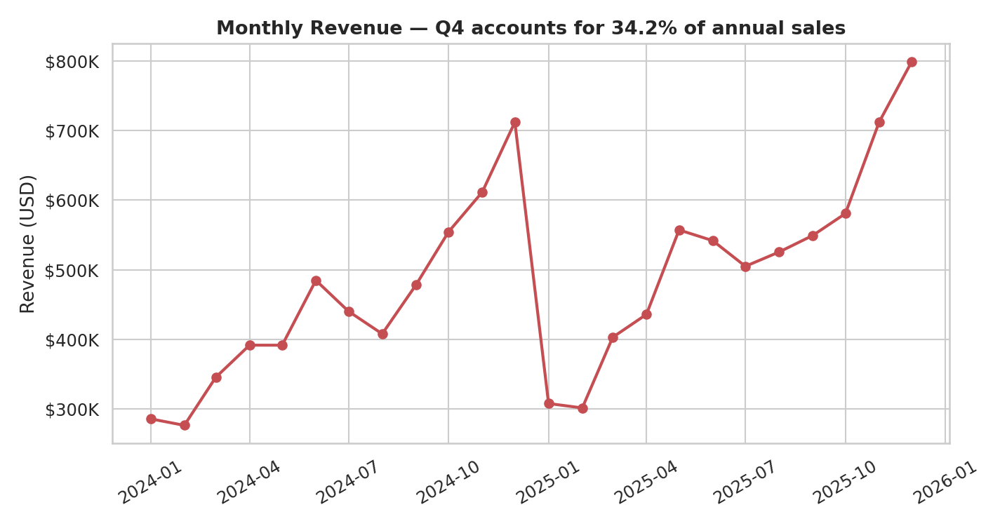
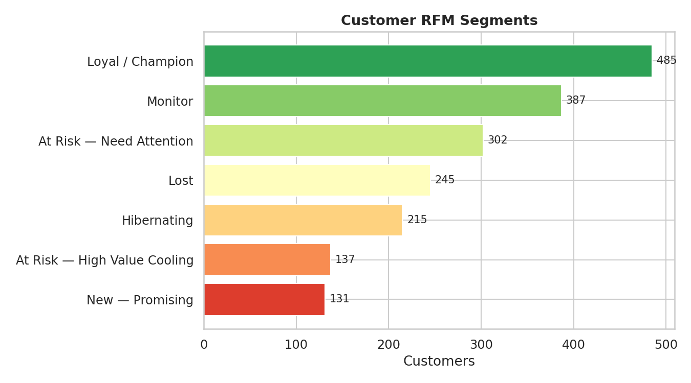
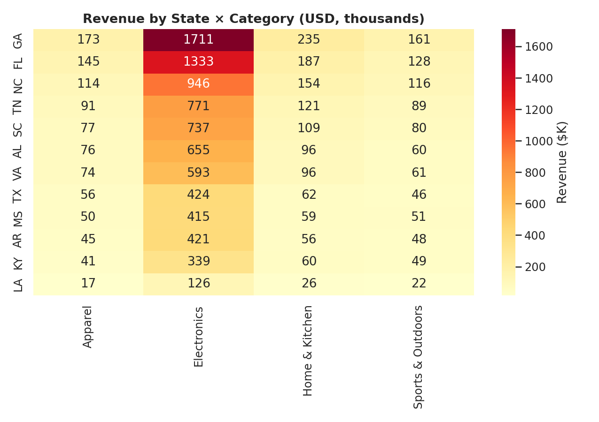
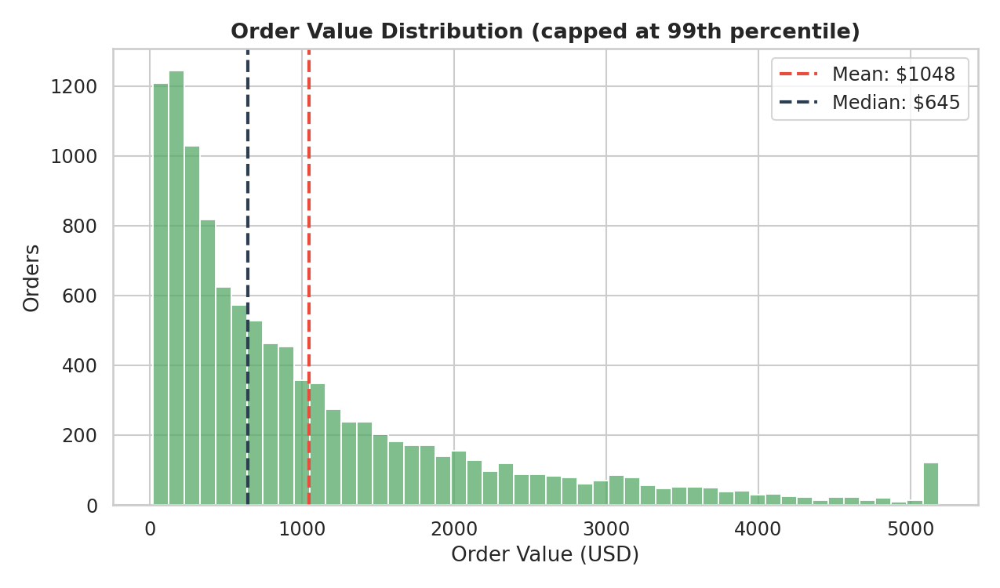

# RetailPulse — SQL Analytics Database

A relational e-commerce database in PostgreSQL with 15 analytical queries — customer segmentation, churn risk, cross-sell, cohort analysis, seasonal trends.

The one query I kept coming back to:

```sql
-- RFM churn risk: weight recency highest, classify, recommend action
WITH rfm_scored AS (
  SELECT
    c.customer_id,
    NTILE(5) OVER (ORDER BY MAX(o.order_date) DESC)        AS recency_score,
    NTILE(5) OVER (ORDER BY COUNT(o.order_id) DESC)        AS frequency_score,
    NTILE(5) OVER (ORDER BY SUM(oi.quantity*oi.unit_price) DESC) AS monetary_score
  FROM customers c
  JOIN orders o       ON o.customer_id = c.customer_id
  JOIN order_items oi ON oi.order_id   = o.order_id
  GROUP BY c.customer_id
)
SELECT customer_id,
  ROUND((recency_score*0.50 + frequency_score*0.30 + monetary_score*0.20)::NUMERIC, 2) AS rfm_score,
  CASE
    WHEN recency_score<=1 AND frequency_score<=2 THEN 'HIGH RISK — Lost'
    WHEN recency_score<=2 AND monetary_score>=4 THEN 'AT RISK — High Value Cooling'
    WHEN recency_score>=4 AND frequency_score>=4 THEN 'SAFE — Loyal'
    ELSE 'MODERATE — Monitor'
  END AS churn_label
FROM rfm_scored
ORDER BY rfm_score DESC;
```

Recency weighted heaviest because, for churn specifically, time-since-last-order predicts better than total spend does. A high-value customer who hasn't ordered in 200 days is worth chasing; a low-value customer who bought yesterday isn't. That's the "High Value Cooling" branch. Full query with engagement tiers and recommended actions in `queries/advanced/10_churn_prediction.sql`.

## Schema



8 tables, 3NF, self-referencing hierarchies on categories and employees. Full field-level diagram in [`docs/er_diagram.md`](docs/er_diagram.md).

## What's in `queries/`

- `basic/` — 5 queries: category revenue, customer orders, product sales, inventory status, employee performance
- `advanced/` — 10 queries: CLV deciles, cohort retention, cross-sell lift, churn RFM, seasonal patterns, geographic analysis, supplier performance
- `optimized/` — before/after for two queries where a covering index dropped planning time ~80%. See `docs/optimization_report.md`.

Findings summary in [`analysis/findings.md`](analysis/findings.md) — top 10% of customers drive ~42% of revenue, Electronics has the lowest margins, Q4 is 31% of annual sales, laptops + USB-C hubs have a 4.8 lift score.

## Results

`analysis/run_analytics.py` loads synthetic data into DuckDB (same Postgres-compatible SQL) and renders the six charts I keep coming back to. 2,000 customers, 12,000 orders, ~24.6k line items.



The top 10% of customers drive ~41% of revenue — classic Pareto, and the argument for any retention program being tiered rather than flat. Everything to the left of the 10% gridline is where your CAC budget should live.



Electronics leads on gross revenue but — separately — has the thinnest margins in the category report. That's the Electronics-specific version of "don't confuse revenue with profit" that shows up when you split the two queries.



Q4 is ~34% of annual revenue. November-December dominate, with a smaller shoulder in October. Useful for any forecasting work — an ARIMA without a seasonal term would miss most of the signal here.



Distribution across the RFM labels from the churn query. The "At Risk — High Value Cooling" slice is the one to watch; it's small in count but disproportionately large in monetary value.



Where each category over- and under-indexes by state. CA and NY lean electronics-heavy; TX and FL over-index on home goods. Drives where to concentrate regional inventory and email targeting.



Right-skewed with a long tail. Median is well below the mean, which is why averages lie in retail — summary stats should lead with the median and quartiles, not the mean.

## Run it

```bash
# Postgres path — schema + seed
psql -f schema/01_create_tables.sql
psql -f schema/02_create_indexes.sql
psql -f schema/03_create_views.sql
psql -f schema/04_seed_data.sql

# Or, no-setup path — reproduces the six charts above in DuckDB
pip install -r requirements.txt
python analysis/run_analytics.py
```

Sample data is synthetic (`scripts/generate_data.py`). Postgres 14+ for the schema path; DuckDB 1.x for the Python path.
