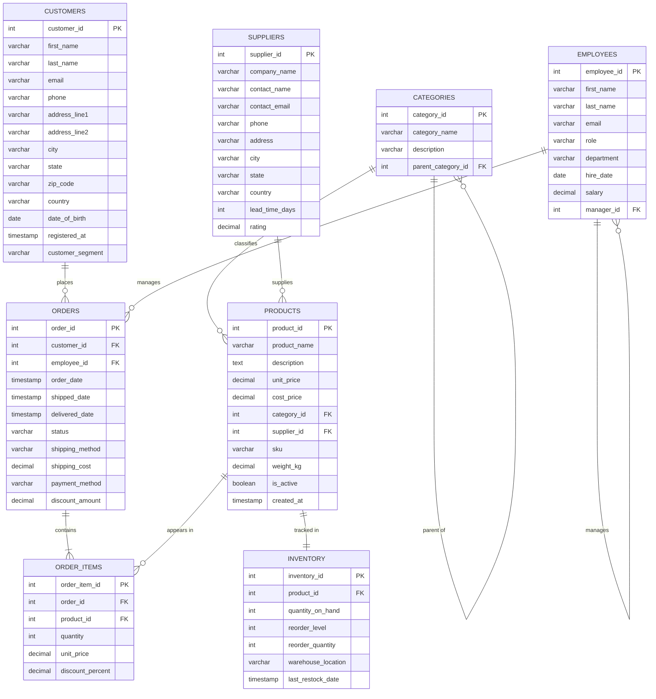

# Entity-Relationship Diagram

## RetailPulse Database — ER Model

This diagram represents the normalized (3NF) relational schema for the RetailPulse e-commerce analytics database. All relationships enforce referential integrity via foreign key constraints.

### Mermaid ER Diagram

### Relationship Summary

| Relationship | Type | Description |
|---|---|---|
| Customers → Orders | One-to-Many | A customer can place many orders |
| Employees → Orders | One-to-Many | An employee (sales rep) handles many orders |
| Orders → Order Items | One-to-Many | An order contains one or more line items |
| Products → Order Items | One-to-Many | A product can appear in many order line items |
| Categories → Products | One-to-Many | A category contains many products |
| Categories → Categories | Self-referencing | Supports subcategory hierarchy |
| Suppliers → Products | One-to-Many | A supplier provides many products |
| Products → Inventory | One-to-One | Each product has one inventory record |
| Employees → Employees | Self-referencing | Manager hierarchy |

### Design Decisions

1. **Normalization (3NF):** All tables are in Third Normal Form. No transitive dependencies exist — for example, customer address fields are stored directly on the customers table rather than in a separate address table, since each customer has a single primary address in this model.

2. **Category hierarchy:** The `categories` table uses a self-referencing foreign key (`parent_category_id`) to support a two-level hierarchy (e.g., Electronics → Laptops, Home & Kitchen → Cookware).

3. **Price snapshot on order_items:** The `unit_price` column on `order_items` captures the price at the time of purchase, decoupled from the current `products.unit_price`. This preserves historical accuracy for revenue calculations.

4. **Employee self-reference:** The `manager_id` column in `employees` enables org-chart queries and hierarchical reporting.

5. **Inventory separation:** Inventory is kept in its own table rather than as columns on `products` to support future multi-warehouse scenarios and independent stock tracking.
